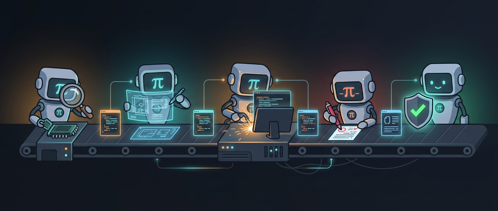

# pi-workflows

<p align="center">
  
</p>

Contract-driven multi-model workflow for [pi](https://github.com/mariozechner/pi-coding-agent).

**Describe what you want. Agents plan, build, and verify through enforceable contracts.**

## Install

```bash
pi install git:github.com/yagaltd/pi-workflows
```

Restart pi. All commands appear in `/` autocomplete.

## Quick Start

```
/idea I want to add caching to the API 
         → you describe what you want
         → scouts codebase, writes plan.md with contracts
         → you review and approve
     
/next    → implements TASK 1 against contract, self-verifies
/next    → implements TASK 2 against contract, self-verifies
/status  → check progress + cost

/review  → mechanical verification + quality review
         → all green? ship it.
```

Three steps: `/idea` → `/next` × N → `/review`. That's the loop.

## Commands

### Starting work

| Command | What it does |
|---|---|
| `/idea <description + repos/URLs>` | Productize idea: explore evidence → grill unresolved decisions → write `plan.md` + `.spec` contracts → stop for approval |
| `/plan <description>` | Plan only — you already have context. Generates contracts with bottleneck tags + testing strategies. |
| `/explore <question>` | Research / kill / prototype. No production plan unless asked. |
| `/amend <change>` | Update existing `plan.md` and specs when decisions change. |
| `/status` | Show plan progress, cost summary, bottleneck breakdown, duration stats. |

### Executing

| Command | What it does |
|---|---|
| `/next` | Execute next pending task. Bottleneck-aware: adjusts model/thinking per task. Handles worker blockers. |
| `/add <feature-or-spec>` | Execute approved contract. Broad ideas route to `/idea`; small surgical requests get mini-recon + contract gate. |
| `/fix <bug>` | Fix a bug within boundaries. Accepts error text, spec files, annotations, screenshots. |
| `/refactor <scope>` | Restructure code within boundaries |
| `/optimize <target>` | Autoresearch loop: benchmark → iterate → keep winners |

### Verification

| Command | What it does |
|---|---|
| `/verify` | 3-layer pipeline: agent-spec → tdd-guard → project checks. Short-circuits on fail. |
| `/review` | Stage 1: mechanical verification (agent-spec + tdd-guard + project checks). Stage 2: quality review (if Stage 1 passes). |
| `/contract [spec]` | Show the contract for a task |
| `/scout <area>` | Isolated recon. Cheapest, no planning. |

### Documentation

| Command | What it does |
|---|---|
| `/docs [area]` | Generate/update project docs |
| `/docs all` | Generate full doc set (architecture, decisions, onboarding) |

### Prototyping

| Command | What it does |
|---|---|
| `/prototype <theories>` | Run parallel mini-prototypes to test approaches and collect benchmarks |
| `/integrate <prototype>` | Integrate validated prototype into production with full verification |

## User Journeys

**Adding a feature?**
```
/idea Add caching to the API
  → explores evidence, grills unresolved decisions, writes plan + contracts
  → you review and approve
/next × N    → implements each task
/review      → verifies everything
```

**Starting from scratch?**
```
/idea Build a REST API for task management
  → explores repo/docs first, then asks only unresolved framework/auth/database choices
  → writes plan + contracts
  → you approve
/next × N → /review → ship
```

**Bug?**
```
/fix The auth tests are failing on CI
  → builds feedback loop, reproduces, ranks hypotheses, fixes, adds regression test
```

**UI bug?**
```
/fix (with pi-annotate)
  → user annotates broken elements with screenshots + selectors
  → agent maps selectors to source files, fixes, asks for re-annotate
```

**Existing codebase needs attention?**
```
/explore What's the state of error handling in this codebase?
  → researches, finds issues, recommends: proceed / pivot / kill
/idea Fix the error handling issues found
  → writes plan + contracts → /next × N → /review
```

**Improve something?**
```
/optimize API response latency
  → autoresearch loop: benchmark, iterate, keep winners
```

**Try multiple approaches?**
```
/prototype approach A vs approach B
  → parallel workers build minimal proofs-of-concept
  → each benchmarks and reports results
/integrate approach A
  → production integration with full verification
```

## How It Works

### The flow

```
IDEA ──► SCOUT ──► PLAN ──► EXECUTE ──► VERIFY ──► QUALITY REVIEW ──► DOCS ──► SHIP
          (cheap)    (architect) (worker)   (mechanical)  (judgment)      (cheap) (you)
                      contracts   /next ×N   agent-spec   + security       /docs
                      bottleneck             + tdd-guard   + simplicity     auto-check
                      testing                + project      + error handling
                      interview*             checks         + human callouts

* interview uses pi-interview when installed, falls back to chat
```

### Gates — worker tasks are verified before moving on

Each worker task goes through three checkpoints that agents **cannot skip**:

```
Worker implements the task
  → Contract gate: did we build the right thing? (agent-spec, deterministic)
  → Test quality gate: are the tests worth trusting? (tdd-guard, deterministic)
  → Quality gate: is the code good? (quality-reviewer, judgment)
```

Short-circuits on first failure. Worker gets failure evidence and retries. You never see a broken task silently passing.

### Two hard rails

| Rail | What it enforces | How |
|---|---|---|
| **Contract** | Did we build the right thing? | agent-spec: BDD scenarios + boundary checks — mechanical, non-negotiable |
| **Test quality** | Are the tests worth trusting? | tdd-guard via agent-spec `--layers` flag — mechanical, non-negotiable |

### JIT contracts

Contracts are written just-in-time: only for the next 1-2 tasks, not the whole plan upfront. The architect writes the first batch during planning. `/next` writes the rest as tasks become eligible.

Why:
- **Fresh context** — contracts incorporate learnings from completed tasks
- **No waste** — if the plan changes mid-run, unused contracts are never written
- **Adaptability** — later contracts adjust based on what worked or didn't

After each task completes, `/next` writes ahead: JIT contracts for the next 1-2 eligible tasks, using learnings from the task that just finished.

Everything else (coding guidelines, architecture preferences) is a **soft rail** — instructions that guide but can't force.

### Agents

| Agent | Model | Purpose |
|---|---|---|
| `scout` | cheap | Fast codebase recon. No project context inherited. |
| `worker` | strong | Building within contract boundaries. Reports blockers. |
| `reviewer` | cheap | Mechanical 3-layer verification only. No judgment. |
| `quality-reviewer` | medium | Judgment-based review after mechanical pass. Security, simplicity, error handling. |

### Bottleneck tags

Every task gets a tag that changes execution strategy:

| Tag | When | What changes |
|---|---|---|
| 🔴 BLOCKING | Others depend on this. Must succeed first. | Strongest model, human review after |
| 🟡 RISKY | Approach uncertain. Might fail. | Prototype first, then build |
| 🔵 TIME_CONSUMING | Large but straightforward. | Break into smaller steps |
| 🟠 VERIFICATION_HEAVY | Needs extensive testing. | Budget extra verification time |
| ⚪ STANDARD | Normal task. | Default flow |

### Testing strategy matrix

Assigned per task based on code type:

| Code type | Strategy | When |
|---|---|---|
| API / CLI command | example-based (agent-spec BDD) | Most tasks |
| Domain logic (math, parsing) | property-based (fast-check, proptest) | Pure functions |
| External input handler | fuzz + example-based | Parsing user data |
| Web UI | example-based + pi-annotate / bombadil | Browser tasks |
| State machine | stateful property tests | Complex state transitions |
| Simple CRUD | example-based only | Boilerplate |

### Worker blocker protocol

When a worker cannot proceed, it outputs a structured `WORKER_BLOCKER` instead of failing silently:

```
WORKER_BLOCKER:
{
  "status": "blocked",
  "reason": "missing_dependency | missing_secret | invalid_contract | ...",
  "evidence": "<what was found>",
  "requestedAction": "<what the human should do>"
}
```

`/next` handles each blocker: rewrites invalid contracts, asks for clarification, or escalates to you.

### Quality pipeline

```
ARCHITECT (strong model)
    │
    ├── Structured interview to gather requirements
    ├── Writes plan.md: atomic tasks, bottleneck tags, testing strategies
    └── Writes JIT contracts for first 1-2 tasks only
    │
    ▼
WORKER (strong model)
    │
    ├── Reads contract → implements within boundaries
    ├── Writes tests matching Completion Criteria
    ├── Self-verifies: agent-spec → tdd-guard → project checks
    ├── Reports WORKER_BLOCKER if stuck
    ├── Logs cost + duration + learnings to plan.md
    └── Writes ahead: JIT contracts for next 1-2 tasks
    │
    ▼
REVIEWER (cheap model, mechanical)
    │
    ├── agent-spec lifecycle (scenarios)
    ├── agent-spec guard (boundaries)
    ├── tdd-guard (test quality)
    └── Project checks (tests, lint, types, build)
    Stops on first failure. No judgment.
    │
    ▼
QUALITY-REVIEWER (medium model, judgment)
    │
    ├── Simplicity (unnecessary abstractions)
    ├── Security (untrusted input, injection)
    ├── Error handling (swallowed errors, silent failures)
    ├── Surgical changes (no scope creep)
    └── Human callouts (new deps, auth changes, migrations)
    Empty review = clean code = success.
```

### Cost strategy

```
CHEAP   (explore/scout/status/docs):      cheap model + low thinking
MEDIUM  (fix/quality-reviewer):           medium model + medium thinking
FULL    (plan/build/refactor):            strongest + high thinking
CURRENT (optimize):                       whatever you're on
```

Cost and duration are estimated by the agent after each task and logged to plan.md. Not metered by pi — the agent reports its own estimate based on token usage visible in the session. `/status` aggregates from plan.md entries.

## Contract Format

Tasks in `plan.md` reference `.spec` files. You review the contract; the worker implements against it.

```markdown
### TASK 2: Add Redis client module
- **Agent**: worker
- **Depends on**: TASK 1
- **Contract**: specs/task-redis-client.spec
- **Bottleneck**: 🔴 BLOCKING
- **Testing strategy**: example-based
- **Status**: ⬜ PENDING
```

The `.spec` file:

```spec
spec: task
name: "Redis cache module"
tags: [cache, redis]
---

## Intent

Add a Redis-backed cache layer for API responses with TTL support.

## Decisions

- Use `redis` crate (already in Cargo.toml)
- Cache key format: `<service>:<resource>:<id>`
- Default TTL: 300 seconds

## Boundaries

### Allowed Changes
- src/cache/**
- src/cache.rs
- tests/cache/**

### Forbidden
- Do not modify existing API handlers
- Do not change the Redis connection pool configuration

## Completion Criteria

Scenario: Set and get cached value
  Test: test_cache_set_then_get_returns_value
  Given Redis is connected
  When I set key "api:user:123" to value "{\"name\":\"Alice\"}" with TTL 300
  Then get("api:user:123") returns "{\"name\":\"Alice\"}"

Scenario: Cache miss returns None
  Test: test_cache_get_nonexistent_key_returns_none
  Given Redis is connected
  When I get key "api:user:999" that does not exist
  Then the result is None
```

## Coding Guidelines (Karpathy)

Workers follow these behavioral rules:

1. **Think Before Coding** — state assumptions, surface tradeoffs, ask if uncertain
2. **Simplicity First** — minimum code, no speculative features, no unnecessary abstractions
3. **Surgical Changes** — touch only what you must, match existing style
4. **Goal-Driven Execution** — define success criteria, loop until verified
5. **Fail-Fast Error Handling** — propagate errors, don't swallow, crash over silent degradation

## Review Rubric

The quality-reviewer uses a structured rubric with priority levels:

| Priority | Meaning |
|---|---|
| **P0** | Drop everything to fix. Blocking release/operations. |
| **P1** | Urgent. Should be addressed in the next cycle. |
| **P2** | Normal. Fix eventually. |
| **P3** | Low. Nice to have. |

Review covers: security, error handling, simplicity, human callouts (new deps, auth changes, migrations).

Add a `REVIEW_GUIDELINES.md` to your project root for project-specific rules. The quality-reviewer loads it automatically. See `templates/REVIEW_GUIDELINES.md` for a starter template.

## Skills

| Skill | Phases | Contract |
|---|---|---|
| `explore` | DEFINE → SCOUT → SYNTHESIZE → PROTOTYPE | No (read-only) |
| `plan` | UNDERSTAND → INTERVIEW → DECOMPOSE → WRITE CONTRACTS → WRITE PLAN → REVIEW → HAND OFF | Generates contracts |
| `add-feature` | SPEC → RECON → BUILD → VERIFY (3-layer) → PRESENT | Implements against contract |
| `fix` | REPRODUCE → DIAGNOSE → FIX → VERIFY (3-layer) → PREVENT | Within boundaries |
| `refactor` | ASSESS → EXECUTE → VERIFY → PRESENT | Behavior preservation contract |

## Requirements

- [pi](https://github.com/mariozechner/pi-coding-agent) >= 0.60
- [pi-subagents](https://github.com/nicobailon/pi-subagents/) >= 0.17.2 — parallel and chain execution
- [pi-prompt-template-model](https://github.com/nicobailon/pi-prompt-template-model) >= 0.9.2 — per-command model/thinking control
- [agent-spec](https://github.com/yagaltd/agent-spec) — contract verification (BDD specs + boundary enforcement)
- [tdd-guard](https://github.com/yagaltd/tdd-guard) >= 0.1.0 — test quality enforcement (integrated as agent-spec `--layers` verification; required)

Install the gate CLIs:

```bash
cargo install --git https://github.com/yagaltd/agent-spec
npm install -g github:yagaltd/tdd-guard
```

Optional:

- [bombadil](https://github.com/antithesishq/bombadil) — property-based web UI testing
- [pi-interview](https://github.com/nicobailon/pi-interview-tool) — structured interview forms for unresolved decisions
- [pi-annotate](https://github.com/nicobailon/pi-annotate) — visual annotation and edit capture for UI review/fixes
- [pi-boomerang](https://github.com/nicobailon/pi-boomerang) — token-efficient autonomous execution and context collapse for long approved tasks
- [pi-autoresearch](https://github.com/davebcn87/pi-autoresearch) — for `/optimize`

Install optional UX helpers:

```bash
pi install npm:pi-interview
pi install npm:pi-annotate
pi install pi-boomerang
```

### Optional extension guidance

- Use `interview()` for 2-7 independent unresolved questions after repo/docs search. Use one-by-one grill for dependent decision trees. Never ask questions answerable from code/docs.
- Use `annotate()` for UI bug reports, frontend polish, visual acceptance, and browser edit capture. It complements Bombadil: annotate is human review; Bombadil is automated UI/property testing.
- Use `/boomerang` for long autonomous work after specs are approved: `/next`, approved `/fix`, large refactors, or prompt chains. Avoid it during `/idea` and `/amend` decision phases.

### Configure models

Edit the `model:` field in prompt files (`prompts/`) and agent files (`agents/`) to match your available models. Both use the same format — `provider/model-id` or bare ID.

Current defaults (edit to match your setup):

| Workflow role | File | Default Model | Thinking |
|---|---|---|---|
| Architect (prompt-only, not a subagent) | `prompts/idea.md`, `prompts/plan.md` | `openai/gpt-5.5` | high |
| Scout | `agents/scout.md`, `prompts/explore.md` | `deepseek/deepseek-v4-pro` | low |
| Builder | `agents/worker.md`, `prompts/add.md`, `prompts/next.md` | `deepseek/deepseek-v4-flash` | high/medium |
| Reviewer | `agents/reviewer.md`, `prompts/review.md`, `prompts/verify.md` | `zai/GLM5.1` | low |
| Quality Reviewer | `agents/quality-reviewer.md` | `deepseek/deepseek-v4-flash` | medium |
| Docs | `prompts/docs.md` | `openrouter/xiaomi/mimo-v2-pro` | low |

## Directory Structure

```
pi-workflows/
├── package.json
├── README.md
├── templates/
│   ├── REVIEW_GUIDELINES.md    # starter template for project-specific rules
│   ├── CONTEXT.md              # starter domain glossary / domain rules
│   └── ADR.md                  # starter architecture decision record
├── agents/
│   ├── scout.md                # cheap, read-only recon, no context inheritance
│   ├── worker.md               # strong, implements within contracts, blocker protocol
│   ├── reviewer.md             # cheap, mechanical 3-layer verification
│   └── quality-reviewer.md     # medium, judgment review after mechanical pass
├── skills/
│   ├── explore/SKILL.md        # research + synthesize + prototype
│   ├── idea/SKILL.md           # evidence → decision tree → plan + contracts
│   ├── plan/SKILL.md           # decompose into atomic tasks + bottleneck tags + contracts
│   ├── add-feature/SKILL.md    # approved contract → build → 3-layer verify
│   ├── amend/SKILL.md          # update plan/specs when decisions change
│   ├── fix/SKILL.md            # feedback loop → hypotheses → fix + regression test
│   ├── refactor/SKILL.md       # assess → execute → verify behavior preserved
│   ├── docs/SKILL.md           # generate/update project docs
│   └── docs-check/SKILL.md     # validate doc freshness
└── prompts/
    ├── idea.md                 # /idea — explore + grill decisions + plan + contracts
    ├── plan.md                 # /plan — decompose from existing context + contracts
    ├── explore.md              # /explore — research / kill / prototype
    ├── amend.md                # /amend — update plan/specs when decisions change
    ├── add.md                  # /add — execute approved contract
    ├── fix.md                  # /fix — accepts error text, specs, annotations, screenshots
    ├── refactor.md             # /refactor — restructure with behavior preservation
    ├── optimize.md             # /optimize — autoresearch loop
    ├── scout.md                # /scout — cheap subagent recon
    ├── review.md               # /review — mechanical + quality (2-stage)
    ├── verify.md               # /verify — 3-layer pipeline with short-circuits
    ├── contract.md             # /contract — show contract for a task
    ├── next.md                 # /next — bottleneck-aware execution + blocker handling
    ├── status.md               # /status — progress + cost summary
    ├── debug.md                # /debug — full diagnose helper
    ├── prototype.md            # /prototype — parallel mini-prototypes
    └── integrate.md            # /integrate — integrate validated prototype
```

## Help

### Starting work

| Command | What it does |
|---|---|
| `/idea <description + repos/URLs>` | Productize idea: explore → grill decisions → plan → specs → approval |
| `/plan <description>` | Decompose into tasks + contracts |
| `/explore <question>` | Research / kill / prototype, no production planning (cheap) |
| `/amend <change>` | Update existing plan/specs when decisions change |
| `/status` | Show plan progress + cost summary (cheap) |

### Executing

| Command | What it does |
|---|---|
| `/next` | Execute next task (reads contract first) |
| `/add <feature-or-spec>` | Execute approved contract; broad ideas route to `/idea` |
| `/fix <bug>` | Diagnose with feedback loop, fix within boundaries |
| `/refactor <scope>` | Restructure code, behavior preserved |
| `/optimize <target>` | Autoresearch loop |

### Prototyping

| Command | What it does |
|---|---|
| `/prototype <theories>` | Parallel mini-prototypes to test approaches |
| `/integrate <prototype>` | Integrate validated prototype into production |

### Verification

| Command | What it does |
|---|---|
| `/contract [spec]` | Show contract for a task |
| `/verify` | 3-layer pipeline: agent-spec + tdd-guard + project checks |
| `/review` | Mechanical verification + quality review (2-stage) |

### Documentation

| Command | What it does |
|---|---|
| `/docs [area]` | Generate/update project docs (cheap model) |
| `/docs all` | Generate full doc set |

### Delegated

| Command | What it does |
|---|---|
| `/scout <area>` | Cheap subagent recon |

### Flow

`/idea` → approve plan → `/next` × N → `/review` → ship
