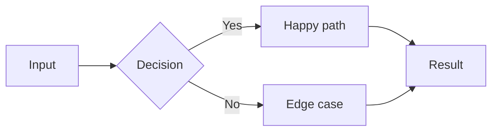
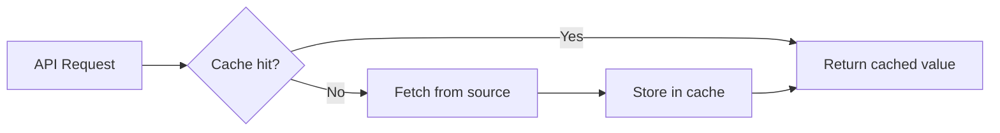

# Contract format — .spec files (agent-spec 1.4)

Loaded on demand at plan Phase 5 (after plan approval). Normative.

```bash
mkdir -p .workflows/specs
```

### Contract template:

```spec
spec: task
name: "<task title>"
tags: [<relevant tags>]
---

## Intent

<What to build and why — 1-3 sentences>

## Diagrams

Optional: add a Mermaid diagram to clarify the flow, architecture, or state machine:



## Decisions

- <Technical choice already fixed>
- <Another fixed decision>

## Boundaries

### Allowed Changes
- <exact file paths or globs>

### Forbidden
- <files or areas that must not change>
- <do not modify existing behavior in X>

## Completion Criteria

Scenario: <descriptive name>
  Test: <exact test function name the worker must write>
  Given <precondition>
  When <action>
  Then <expected outcome>
  And <additional assertion>

Scenario: <edge case name>
  Test: <test function name>
  Given <precondition>
  When <action>
  Then <expected outcome>
```

### Contract writing rules:
- Every BDD scenario MUST have an explicit `Test:` selector — the exact function name
- Boundaries MUST list specific file paths, not vague descriptions
- Decisions are fixed — the worker may not re-open them
- Completion Criteria define "done" — if all scenarios pass, the task is done
- Include edge cases: error states, boundary values, empty inputs
- Include at least one negative scenario (what should fail)
- Optional frontmatter `max-rounds: N` (default 2) — cap for reviewer-rejection fix
  rounds. Raise for tasks expected to need iteration (UI, integration); the cap
  exists so rejection loops escalate to the human instead of looping forever.
- **Diagrams**: add a `## Diagrams` section with a Mermaid diagram when the flow, architecture, or state machine is non-trivial. This helps the worker understand the expected behavior at a glance.

### Example contract:

```spec
spec: task
name: "Redis cache module"
tags: [cache, redis, api]
---

## Intent

Add a Redis-backed cache layer for API responses with TTL support.

## Diagrams



## Decisions

- Use `redis` crate (already in Cargo.toml)
- Cache key format: `<service>:<resource>:<id>`
- Default TTL: 300 seconds

## Boundaries

### Allowed Changes
- src/cache/**
- src/cache.rs
- tests/cache/**

### Forbidden
- Do not modify existing API handlers
- Do not change the Redis connection pool configuration
- Do not alter response serialization

## Completion Criteria

Scenario: Set and get cached value
  Test: test_cache_set_then_get_returns_value
  Given Redis is connected
  When I set key "api:user:123" to value "{\"name\":\"Alice\"}" with TTL 300
  Then get("api:user:123") returns "{\"name\":\"Alice\"}"

Scenario: Cache miss returns None
  Test: test_cache_get_nonexistent_key_returns_none
  Given Redis is connected
  When I get key "api:user:999" that does not exist
  Then the result is None

Scenario: Expired key returns None
  Test: test_cache_expired_key_returns_none
  Given key "api:user:456" was set with TTL 1 second
  When 2 seconds have passed
  Then get("api:user:456") returns None

Scenario: Delete removes cached key
  Test: test_cache_delete_removes_key
  Given key "api:user:789" exists in cache
  When I delete "api:user:789"
  Then get("api:user:789") returns None
```

Present the generated contracts to the human for a final quick check, then proceed to handoff.

